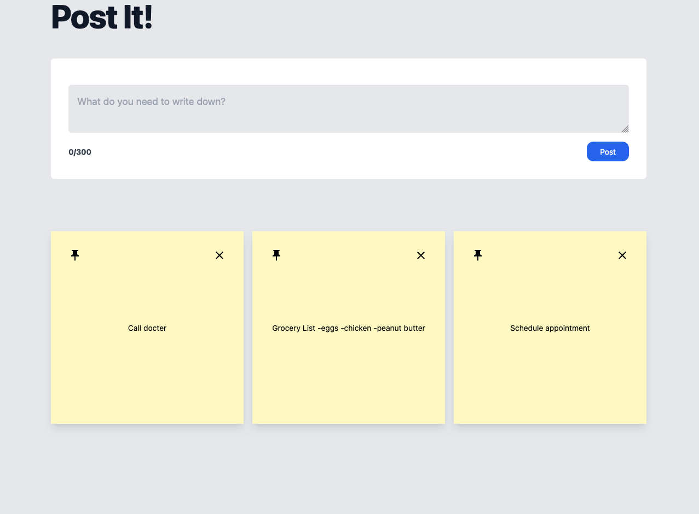
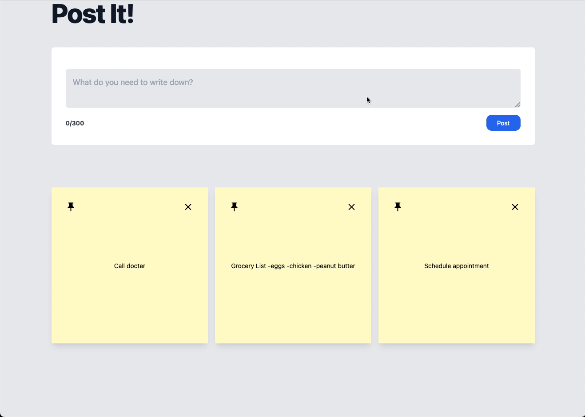

# Typescript Next.JS Post It Board:

## Description

_Duration: 6 hour Sprint_

Over the course of two, the goal was to create a functional full-stack web based application using Typscript, Next.JS, and Tailwind.CSS. The project served as an introduction to me on how to use these three programs. The web based application is a post it note board for users to keep track of anything they want to write down.

## Screen Shots
Preview:

GIF showing application features:

### Prerequisites
- [Node.js](https://nodejs.org/en/)
- [React.js](https://react.dev/)
- [Next.js](https://nextjs.org/)
- [Tailwind.css](https://tailwindcss.com/)
- Express 
- Body-Parser
- 'PG'
- Database Manager

## Installation
1. Clone this repository for your own access.
2. Open up your editor of choice and run `npm install`
3. Using your preferred database manager. Use the provided SQL file to set up the database as well as insert dummy data if needed. 
4. Run `npm run dev`  and `npm run client` in two different terminals.
5. Navigate to http://localhost3000/

## Usage
This web application is meant to create an interactive gallery where users can add their own images:
 1. Using the provided input field to input any notes you would like to put on the post it note.
 2. By clicking on the pin button, users can pin post it notes that they deem important.
 3. By clicking on the X, users can see delete any post it notes.

## Support
If you have suggestions or issues, please email me at [paulhoanglong@gmail.com](www.google.com)